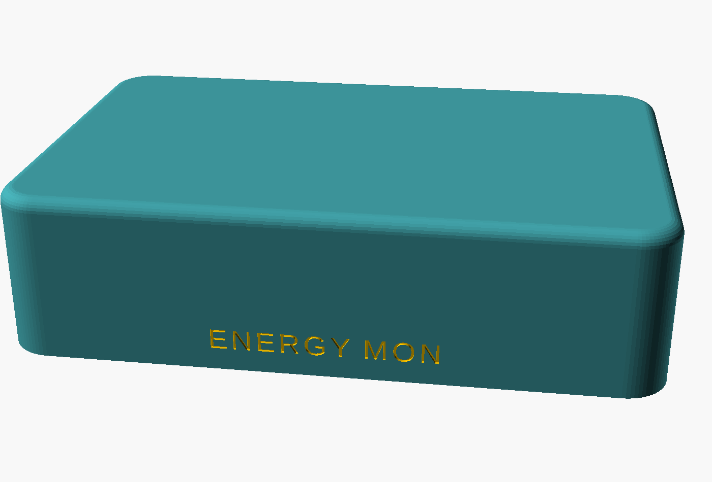
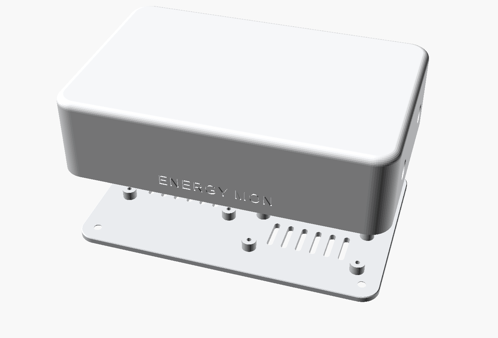
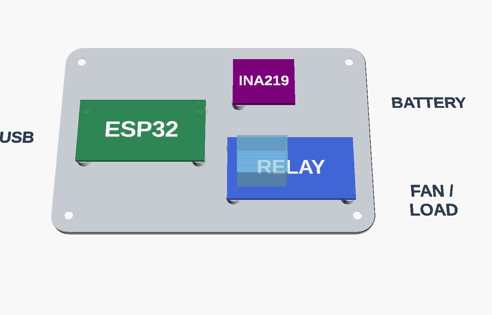

# 3D-Printable Enclosure — "Unibody" design

Parametric OpenSCAD enclosure for the ESP32 + INA219 + relay energy monitor,
styled after minimalist consumer hardware: one-piece top shell with large
corner radii and a rolled top edge, **no visible fasteners** (screwed from
below, screws hidden under adhesive rubber feet), all ventilation on the
underside, and a subtle engraved wordmark on the front.

**All dimensions are placeholders based on typical modules** — measure your
actual boards and edit the `PARAMETERS` block at the top of
[`enclosure.scad`](./enclosure.scad), then re-export.







| File | Description |
| --- | --- |
| `enclosure.scad` | Parametric source (edit this) |
| `enclosure-shell.stl` | One-piece top shell, ready to print |
| `enclosure-plate.stl` | Bottom plate with PCB standoffs, ready to print |
| `preview-*.png` | Renders: beauty / exploded / layout / print / underside |

## Design

- **Top shell**: seamless walls + top, 9 mm plan radius, 2.8 mm rolled top
  edge; USB opening on the left, two Ø8 mm wire ports on the right
  (battery in, fan/load out), engraved `ENERGY MON` wordmark on the front.
- **Bottom plate**: drops into a rebate in the shell rim, flush with the
  bottom. Carries all PCB standoffs (ESP32 4×, INA219 2×, relay 4×) and two
  hidden vent grilles under the warm bays.
- **Fasteners**: 4× M3 self-tapping screws go up through countersunk holes in
  the plate into corner bosses inside the shell. Each screw sits inside a
  shallow Ø10 recess — stick adhesive rubber feet (Ø10, ≥2 mm tall) over them
  to hide the screws and create the underside air gap.

## Printing (no supports anywhere)

| Part | Orientation | Notes |
| --- | --- | --- |
| Shell | Top face down (as in `part="print"`) | The show surfaces (top + walls) print against smooth vertical walls; wordmark prints vertically = crisp |
| Plate | Bottom face down | Standoffs point up |

PETG or PLA · 0.2 mm layers · 3 perimeters. A matte filament and a textured
build plate make the big top face look particularly good.

## What to measure on your boards

| Parameter(s) | Measure |
| --- | --- |
| `esp_size`, `ina_size`, `rly_size` | PCB length × width |
| `*_hole_inset` | Mounting-hole centre distance from board corner |
| `esp_pos`, `ina_pos`, `rly_pos` | Where each board sits in the cavity (lower-left corner, mm) |
| `usb_w`, `usb_h`, `usb_z` | USB connector width/height and height above the plate top |
| `inner_z` | Tallest component (usually the relay cube) + clearance |
| `port_d`, `port1_y`, `port2_y` | Wire bundle diameter and port positions |
| `wordmark` | Any text you like, `""` for a fully clean front |

## Export

```sh
openscad -o enclosure-shell.stl -D 'part="shell"' enclosure.scad
openscad -o enclosure-plate.stl -D 'part="plate"' enclosure.scad
```

`part = "assembly"` exploded preview · `"beauty"` closed box · `"layout"`
annotated component bays · `"print"` print orientation.
