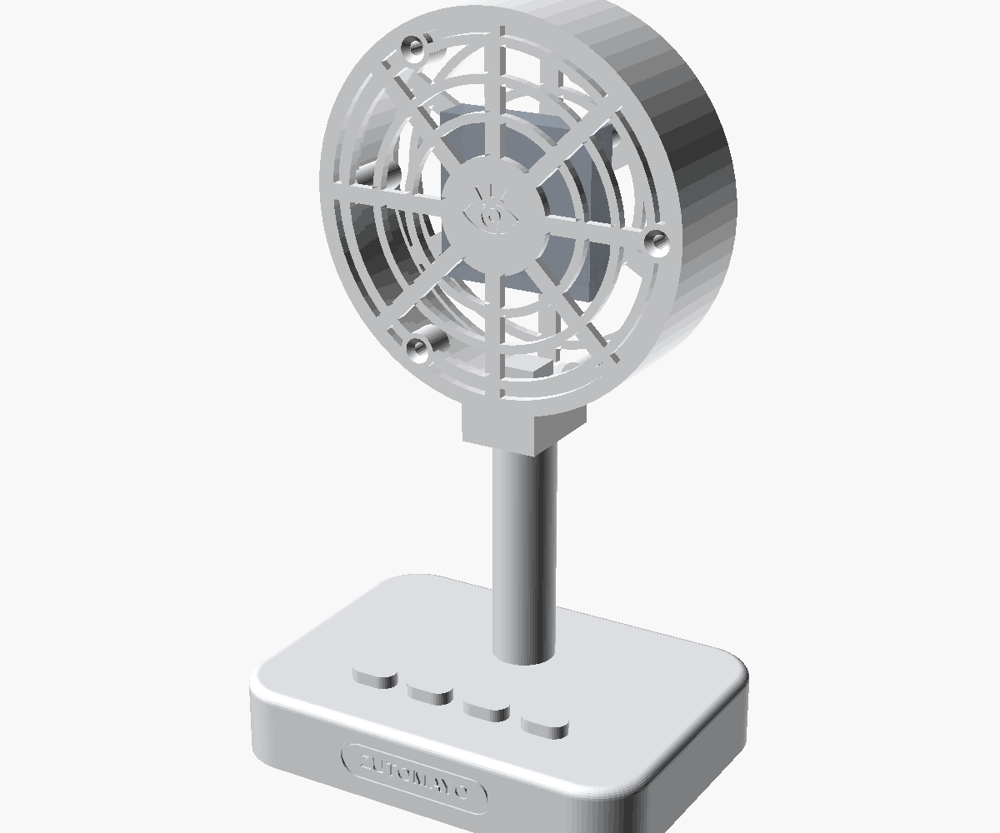
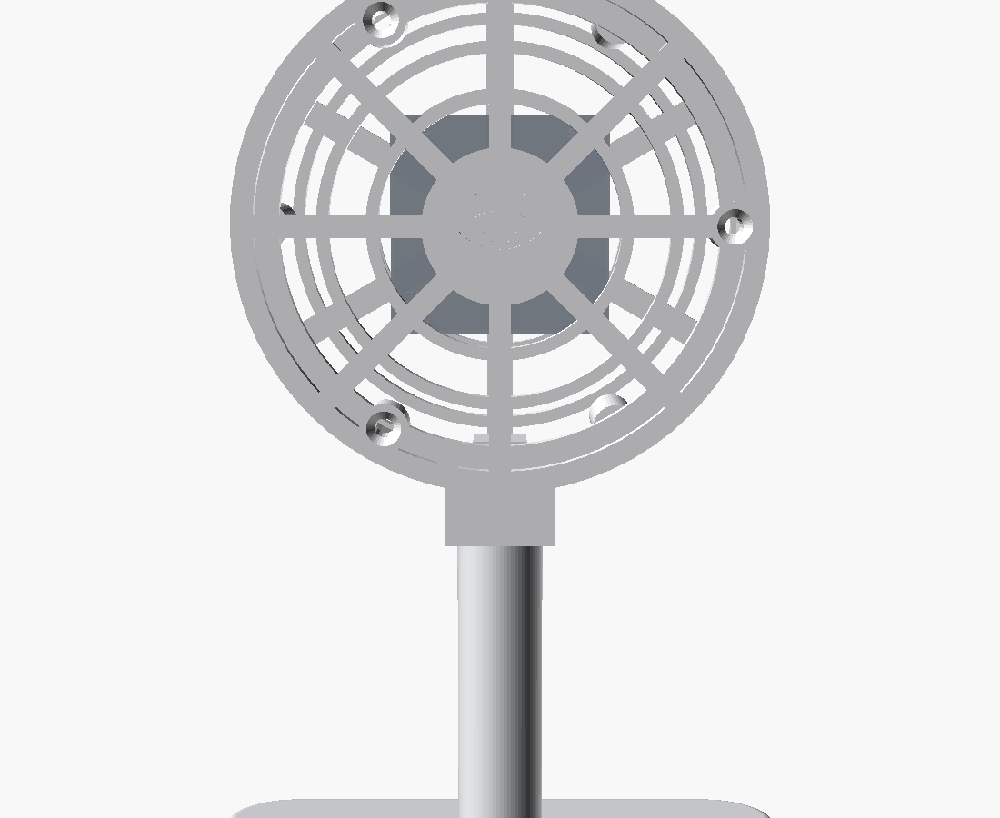

# ZUTOMAYO Retro Desktop Fan Body

A Kinscoter-style retro desk-fan body for the project's bare 2-wire DC fan,
so the monitored load looks like a proper vintage fan and matches the
ZUTOMAYO enclosure. Electrically nothing changes — it is still your own
small axial fan inside, so INA219 measurement, relay cut-off and MOSFET
PWM all keep working.

**Fan dimensions are placeholders for a typical 40 mm axial fan** — measure
yours (frame edge, thickness, mounting-hole spacing) and edit the
`PARAMETERS` block in [`retro-fan.scad`](./retro-fan.scad).

| File | Description |
| --- | --- |
| `retro-fan.scad` | Parametric source |
| `fan-head-back.stl` | Rear cage: fan posts, rear grille, stem socket |
| `fan-head-front.stl` | Front grille with ZTMY eye hub, 3 screw ears |
| `fan-stand.stl` | Base (fake buttons + ZUTOMAYO badge) and stem |

## Assembly

1. Screw the fan onto the four rear posts (M3 self-tapping, through the
   fan's own corner holes).
2. Route the wire through the groove on the back of the stem block.
3. Drop the head onto the stem's square tenon, lock with one M3 from the
   rear of the block.
4. Screw the front grille on (3× M3 into the wall bosses).
5. Wire runs down the stem groove, through the base, out the back
   underside channel. Stick rubber feet in the four recesses.

## Printing (all parts support-free)

| Part | Orientation |
| --- | --- |
| Head back | Rear grille on the bed |
| Head front | Show face on the bed |
| Stand | Upright, as modelled |

Suggested colours: matcha-green body + cream grilles (or the reverse) to
match the ZUTOMAYO enclosure; paint the second button orange like the
original fan.
